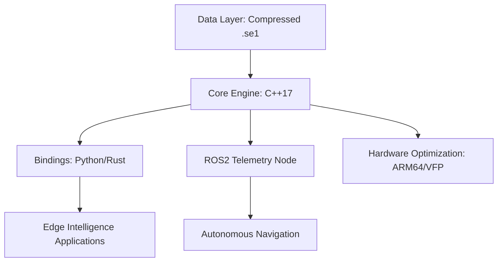

# 🌌 OrbitalEdge (Edge-Ephemeris)


[](https://opensource.org/licenses/MIT)
[](https://isocpp.org/)
[](https://www.rust-lang.org/)
[](https://docs.ros.org/en/humble/)
[](https://developer.nvidia.com/embedded/jetson-developer-kits)

**OrbitalEdge**, gömülü sistemler, IoT cihazları ve otonom robotlar için tasarlanmış, **sıfır gecikmeli (zero-latency) ve %100 çevrimdışı** çalışan bir astronomik hesaplama motorudur.

Bulut tabanlı API'lerin aksine, OrbitalEdge doğrudan cihaz üzerinde (on-premise) çalışır. Otonom sistemlerin veya akıllı IoT cihazlarının, internet bağlantısı olmaksızın anlık gökyüzü konumlarını, gezegen açılarını ve ephemeris verilerini donanım hızlandırmasıyla hesaplamasını sağlar.

---

## 🏗️ Architecture & High-Density Specifications

OrbitalEdge is built on a modular "7-tier" engineering philosophy, ensuring scalability from micro-controllers to advanced robotic platforms.



### Key Technical Pillars
*   **Offline-First Architecture**: Entire ephemeris database is stored locally. No dependency on external APIs or connectivity.
*   **Micro-footprint Performance**: C++17 core designed for deterministic memory usage and minimal CPU overhead.
*   **Hardware Acceleration**: Specialized build flags for ARM64 (NEON/VFP) optimizing astronomical trigonometric operations.
*   **Unified Interface**: Access the core engine via high-performance bindings (Python/Rust) or via the ROS2 middleware ecosystem.

---

## 📂 Repository Structure (7-Tier Scaffolding)

| Tier | Component | Description |
| :--- | :--- | :--- |
| **00** | **Meta & Governance** | Licensing, Contribution guidelines, and Project Manifest. |
| **01** | **Core Engine** | High-performance C++17 astronomical calculation logic. |
| **02** | **Bindings** | Native interfaces for Python (Pybind11) and Rust (cxx). |
| **03** | **Robotics** | ROS2 (Humble) integration for real-time celestial telemetry. |
| **04** | **Data Hub** | Compressed offline ephemeris binary storage. |
| **05** | **Hardware Lab** | Optimization profiles for Jetson Nano/Orin and RPi 4/5. |
| **06** | **Research** | Advanced cases: Celestial-based navigation & Edge AI models. |

---

## 🚀 Getting Started (Jetson / Linux ARM64)

### Core Engine Compilation (C++)
```bash
mkdir build && cd build
cmake .. -DCMAKE_BUILD_TYPE=Release
make -j$(nproc)
sudo make install
```

### Python Integration (Fast Prototyping)
```bash
cd bindings/python
pip install .
```

---

## 💻 Example Usage (Python)

```python
import orbital_edge as oe

# Initialize engine with local data path
engine = oe.EphemerisEngine("/opt/orbital_edge/data")

# Device location (Latitude/Longitude)
lat, lon = 40.99, 39.71

# Compute Solar position with zero latency
sun_data = engine.get_planet_pos(oe.Planets.SUN, lat, lon)
print(f"Sun Altitude: {sun_data.altitude:.4f}°")
```

---

## 🤖 ROS2 Integration

Bridge astronomical intelligence to your robotic stack:
```bash
source install/setup.bash
ros2 run orbital_edge_ros telemetry_node
```
Listen to celestial telemetry on `/astro/telemetry`.

---

## 🗺️ Roadmap

- [x] C++17 Core Engine & Memory Optimization
- [x] Python Wrapper (Pybind11)
- [ ] Rust Crate Implementation
- [ ] MQTT Lightweight Messaging for IoT
- [ ] Celestial-Adaptive Navigation Algorithms

---

## 🤝 Contributing & License

We welcome contributions from the embedded and robotics community. Please review [CONTRIBUTING.md](CONTRIBUTING.md) for architectural standards.

OrbitalEdge is released under the **MIT License**.
