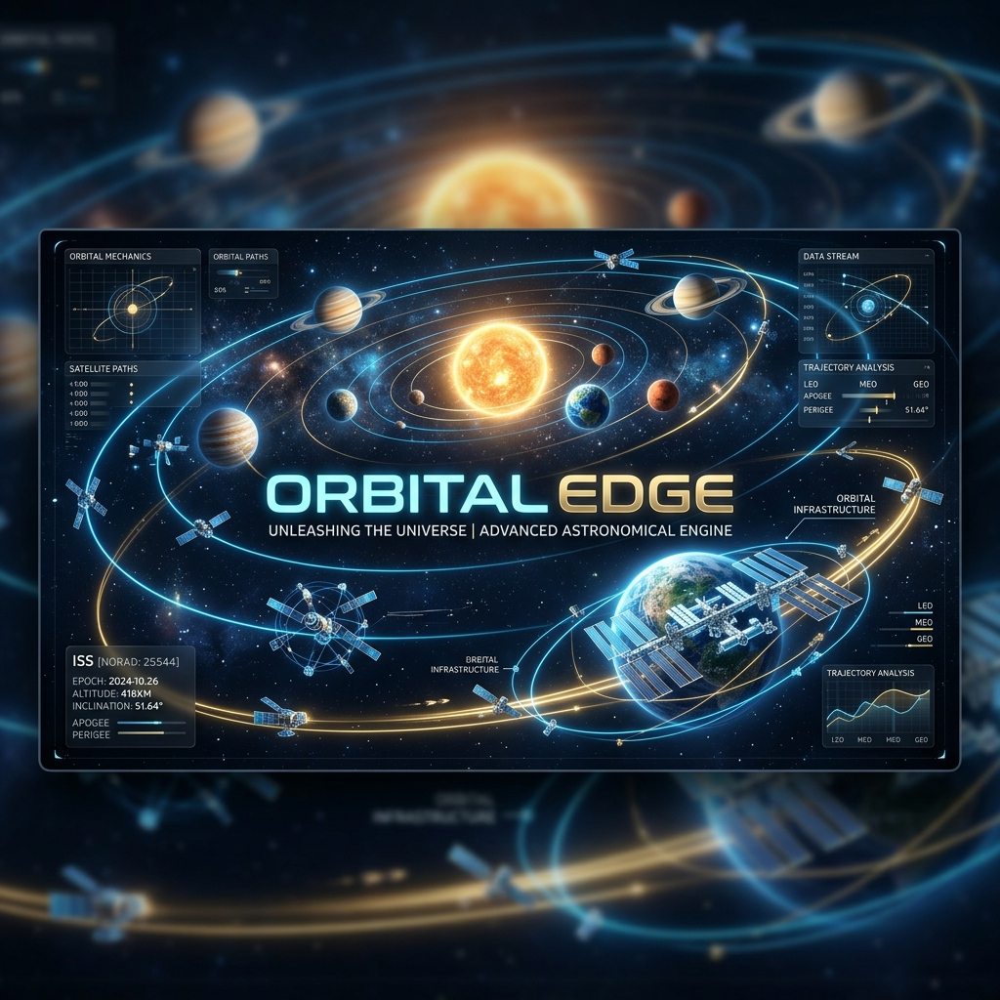
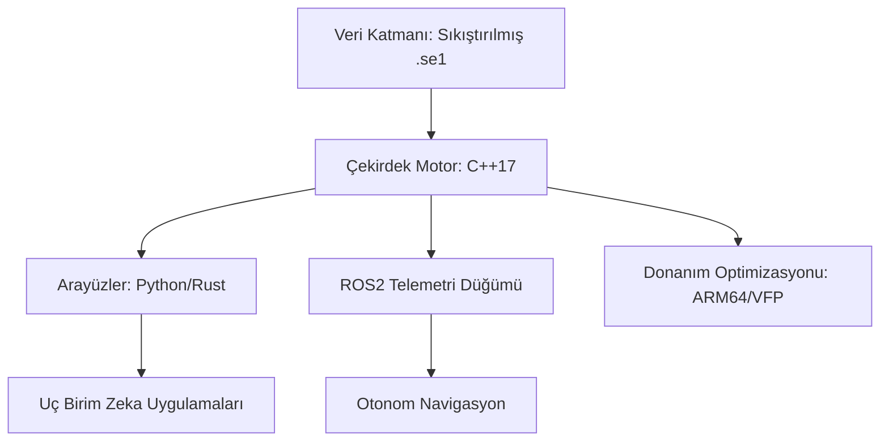

# 🌌 OrbitalEdge (Edge-Ephemeris)



[](https://opensource.org/licenses/MIT)
[](https://isocpp.org/)
[](https://www.rust-lang.org/)
[](https://docs.ros.org/en/humble/)
[](https://developer.nvidia.com/embedded/jetson-developer-kits)

**OrbitalEdge**, gömülü sistemler, IoT cihazları ve otonom robotlar için tasarlanmış, **sıfır gecikmeli (zero-latency) ve %100 çevrimdışı** çalışan bir astronomik hesaplama motorudur.

Bulut tabanlı API'lerin aksine, OrbitalEdge doğrudan cihaz üzerinde (on-premise) çalışır. Otonom sistemlerin veya akıllı IoT cihazlarının, internet bağlantısı olmaksızın anlık gökyüzü konumlarını, gezegen açılarını ve ephemeris verilerini donanım hızlandırmasıyla hesaplamasını sağlar.

---

## 🏗️ Mimari ve Yüksek Yoğunluklu Teknik Özellikler

OrbitalEdge, mikrodenetleyicilerden gelişmiş robotik platformlara kadar ölçeklenebilirlik sağlayan modüler bir "7-katmanlı" mühendislik felsefesi üzerine inşa edilmiştir.



### Temel Teknik Sütunlar
*   **Çevrimdışı Öncelikli Mimari**: Tüm ephemeris veritabanı yerel olarak saklanır. Dış API veya bağlantı bağımlılığı yoktur.
*   **Mikro-Ayak İzi Performansı**: Deterministik bellek kullanımı ve minimum CPU yükü için tasarlanmış C++17 çekirdeği.
*   **Donanım Hızlandırması**: Astronomik trigonometrik işlemleri optimize eden ARM64 (NEON/VFP) için özel derleme bayrakları.
*   **Birleşik Arayüz**: Çekirdek motora yüksek performanslı Python/Rust bindings veya ROS2 ara katman yazılımı üzerinden erişim.

---

## 📂 Depo Yapısı (7-Katmanlı İskelet)

| Katman | Bileşen | Açıklama |
| :--- | :--- | :--- |
| **00** | **Meta ve Yönetişim** | Lisanslama, Katkıda Bulunma kılavuzları ve Proje Bildirgesi. |
| **01** | **Çekirdek Motor** | Yüksek performanslı C++17 astronomik hesaplama mantığı. |
| **02** | **Arayüzler** | Python (Pybind11) ve Rust (cxx) için yerel arayüzler. |
| **03** | **Robotik** | Gerçek zamanlı gökyüzü telemetrisi için ROS2 (Humble) entegrasyonu. |
| **04** | **Veri Merkezi** | Sıkıştırılmış çevrimdışı ephemeris ikili veri depolama. |
| **05** | **Donanım Laboratuvarı** | Jetson Nano/Orin ve RPi 4/5 için optimizasyon profilleri. |
| **06** | **Araştırma** | Gelişmiş vakalar: Göksel navigasyon ve Uç Birim AI modelleri. |

---

## 🚀 Başlangıç (Jetson / Linux ARM64)

### Çekirdek Motor Derlemesi (C++)
```bash
mkdir build && cd build
cmake .. -DCMAKE_BUILD_TYPE=Release
make -j$(nproc)
sudo make install
```

---

## 💻 Örnek Kullanım (C++)

```cpp
#include <orbital_edge/ephemeris_engine.hpp>
#include <iostream>

int main() {
    using namespace orbital_edge;
    
    // Motoru yerel veri yoluyla başlat
    EphemerisEngine engine("/opt/orbital_edge/data");

    // Cihaz konumu (Enlem/Boylam)
    double lat = 40.99, lon = 39.71;

    // Sıfır gecikme ile Güneş konumunu hesapla
    auto sun_data = engine.get_planet_pos(Planets::SUN, lat, lon);
    std::cout << "Güneş Yüksekliği: " << sun_data.altitude << "°" << std::endl;
    
    return 0;
}
```

---

## 🤖 ROS2 Entegrasyonu

Astronomik zekayı robotik yığınınıza bağlayın:
```bash
source install/setup.bash
ros2 run orbital_edge_ros telemetry_node
```
`/astro/telemetry` konusu üzerinden göksel verileri dinleyin.

---

## 🗺️ Yol Haritası

- [x] C++17 Çekirdek Motor ve Bellek Optimizasyonu
- [x] Astronomik Analitik Algoritmaların Uygulanması (VSOP87)
- [ ] Python Binding (Pybind11) - *Geliştirme Aşamasında*
- [ ] Rust Crate Uygulaması
- [ ] Göksel Navigasyon Algoritmaları

---

## 🤝 Katkıda Bulunma ve Lisans

Gömülü sistemler ve robotik topluluğundan gelen katkıları bekliyoruz. Mimari standartlar için [CONTRIBUTING.md](CONTRIBUTING.md) dosyasını inceleyin.

OrbitalEdge, **MIT Lisansı** altında sunulmaktadır.
