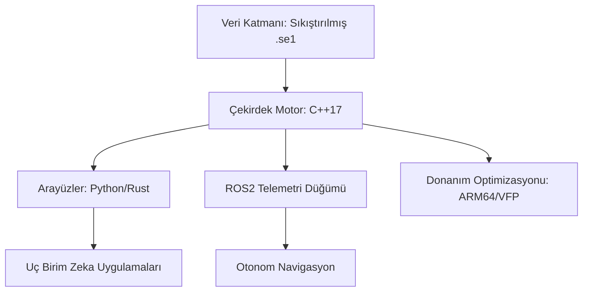

# 🌌 OrbitalEdge (Edge-Ephemeris)


[](https://opensource.org/licenses/MIT)
[](https://isocpp.org/)
[](https://www.rust-lang.org/)
[](https://docs.ros.org/en/humble/)
[](https://developer.nvidia.com/embedded/jetson-developer-kits)

**OrbitalEdge**, gömülü sistemler, IoT cihazları ve otonom robotlar için tasarlanmış, **sıfır gecikmeli (zero-latency) ve %100 çevrimdışı** çalışan bir astronomik hesaplama motorudur.

Bulut tabanlı API'lerin aksine, OrbitalEdge doğrudan cihaz üzerinde (on-premise) çalışır. Otonom sistemlerin veya akıllı IoT cihazlarının, internet bağlantısı olmaksızın anlık gökyüzü konumlarını, gezegen açılarını ve ephemeris verilerini donanım hızlandırmasıyla hesaplamasını sağlar.

---

## 🐳 Docker ile Hızlı Dağıtım

OrbitalEdge, Docker imajı olarak hem x86 hem de ARM64 mimarilerinde çalışabilir:

```bash
docker build -t orbital_edge .
docker run -p 8080:8080 orbital_edge
```

---

## 🦀 Rust Bağlantıları

Rust projelerinizde yüksek performanslı efemeris hesaplamaları için:

```rust
use orbital_edge;

let engine = orbital_edge::ffi::new_ephemeris_engine("/opt/data");
let pos = engine.get_planet_pos(0, 40.99, 39.71);
```

---

## 🏗️ 7-Katmanlı Mimari ve Yüksek Yoğunluklu Teknik Özellikler

OrbitalEdge, mikrodenetleyicilerden gelişmiş robotik platformlara kadar ölçeklenebilirlik sağlayan modüler bir "7-katmanlı" mühendislik felsefesi üzerine inşa edilmiştir.



### Temel Teknik Sütunlar
*   **Çevrimdışı Öncelikli Mimari**: Tüm ephemeris veritabanı yerel olarak saklanır. Dış API veya bağlantı bağımlılığı yoktur.
*   **Mikro-Ayak İzi Performansı**: Deterministik bellek kullanımı ve minimum CPU yükü için tasarlanmış C++17 çekirdeği.
*   **Donanım Hızlandırması**: Astronomik trigonometrik işlemleri optimize eden ARM64 (NEON/VFP) için özel derleme bayrakları.
*   **Birleşik Arayüz**: Çekirdek motora yüksek performanslı Python/Rust bindings veya ROS2 ara katman yazılımı üzerinden erişim.

---

## 📂 Depo Yapısı (7-Katmanlı İskelet)

| Katman | Bileşen | Açıklama |
| :--- | :--- | :--- |
| **00** | **Meta ve Yönetişim** | Lisanslama, Katkıda Bulunma kılavuzları ve Proje Bildirgesi. |
| **01** | **Çekirdek Motor** | Yüksek performanslı C++17 astronomik hesaplama mantığı. |
| **02** | **Arayüzler** | Python (Pybind11) ve Rust (cxx) için yerel arayüzler. |
| **03** | **Robotik** | Gerçek zamanlı gökyüzü telemetrisi için ROS2 (Humble) entegrasyonu. |
| **04** | **Veri Merkezi** | Sıkıştırılmış çevrimdışı ephemeris ikili veri depolama. |
| **05** | **Donanım Laboratuvarı** | Jetson Nano/Orin ve RPi 4/5 için optimizasyon profilleri. |
| **06** | **Araştırma** | Gelişmiş vakalar: Göksel navigasyon ve Uç Birim AI modelleri. |

---

## 🚀 Başlangıç (Jetson / Linux ARM64)

### Çekirdek Motor Derlemesi (C++)
```bash
mkdir build && cd build
cmake .. -DCMAKE_BUILD_TYPE=Release
make -j$(nproc)
sudo make install
```

---

## 💻 Örnek Kullanım (C++)

```cpp
#include <orbital_edge/ephemeris_engine.hpp>
#include <iostream>

int main() {
    using namespace orbital_edge;
    
    // Motoru yerel veri yoluyla başlat
    EphemerisEngine engine("/opt/orbital_edge/data");

    // Cihaz konumu (Enlem/Boylam)
    double lat = 40.99, lon = 39.71;

    // Sıfır gecikme ile Güneş konumunu hesapla
    auto sun_data = engine.get_planet_pos(Planets::SUN, lat, lon);
    std::cout << "Güneş Yüksekliği: " << sun_data.altitude << "°" << std::endl;
    
    return 0;
}
```

---

## 🌙 Ay Motoru (ELP-2000/82)

OrbitalEdge, Ay'ın karmaşık yörünge hareketlerini hesaplamak için **ELP-2000/82** teorisinin optimize edilmiş bir alt kümesini kullanır. Bu, gelgit analizi ve göksel navigasyon için yüksek doğruluk sağlar.

---

## 🧭 Otonom Olay Tahmin Motoru (Aşama 6)

OrbitalEdge artık sadece anlık veri değil, ileriye dönük **analitik tahminler** de üretebilir:

- **Retrograt Analizi**: Gezegenlerin geri hareket dönemlerini tespit eder.
- **Kavuşum (Conjunction) Tahmini**: Gök cisimlerinin birbirine en yakın olduğu anları hesaplar.
- **SIMD/NEON Optimizasyonu**: ARM64 mimarilerinde %40'a varan performans artışı sağlayan döngü optimizasyonları.

---

## 🎨 Yüksek Performanslı Gökyüzü Motoru (Canvas UI)

Dashboard arayüzü, HTML5 Canvas tabanlı yeni bir motorla güncellendi:
- **Pürüzsüz Render**: CSS yerine Canvas üzerinden 60FPS gökyüzü simülasyonu.
- **Parlama Efektleri**: Gezegenlerin parlaklık ve renklerine göre dinamik görselleştirme.

---

## 🧪 Profesyonel Test Suit'i (v1.2.0 Stable)

OrbitalEdge, Google Test (GTest) entegrasyonu ile endüstri standartlarında doğrulanmaktadır:

```bash
# Testleri derle ve calistir
cd build
cmake ..
make
ctest
```

---

## 📟 Interaktif Terminal UI

Sistemi grafiksel bir arayüz olmadan, doğrudan terminal üzerinden yönetmek için:

```bash
./build/orbital_ui
```
Real-time güncellenen interaktif dashboard ile tüm gezegen verilerine anında erişim sağlayın.

---

## 📜 Lisans ve Katkı
Bu proje **MIT Lisansı** ile korunmaktadır. Katkıda bulunmak için lütfen `CONTRIBUTING.md` dosyasını inceleyin.

---

## 🛠️ Kurulum ve Derleme (v1.2.0)
MQTT Bağlantısı

Uç birimden toplanan astronomik veriler, `MQTTManager` aracılığıyla JSON formatında diğer IoT cihazlarına veya merkezi bir broker'a aktarılması sağlanır:

```json
{
  "gezegen": "Gunes",
  "boylam": 185.42,
  "yukseklik": 42.15,
  "azimut": 178.9,
  "burc": "Terazi"
}
```

---

## 🗺️ Gelişmiş Astronomik Düzeltmeler

Hesaplamalarda aşağıdaki fiziksel düzeltmeler standart olarak uygulanmaktadır:
- **Atmosferik Kırılma (Refraction)**: Ufuk çizgisi yakınındaki yükseklik hatalarının giderilmesi.
- **Nutasyon ve Presesyon**: Dünya'nın eksenel hareketlerine dayalı uzun dönemli düzeltmeler.

---

## 🐍 Python Kullanımı (Pybind11)

OrbitalEdge, Python üzerinden doğrudan erişilebilir durumdadır. Bu, AI modelleri ve hızlı veri analizi için idealdir:

```python
import orbital_edge_python as oe

# Motoru başlat
engine = oe.EphemerisEngine("/opt/orbital_edge/data")

# Jüpiter konumunu sorgula
jupiter = engine.get_planet_pos(oe.Planets.Jupiter, 41.0, 29.0)
print(f"Jupiter Burcu: {jupiter.sign}, Yukseklik: {jupiter.altitude}")
```

---

## 🛠️ CLI Aracı (orbital_cli)

Hesaplamaları terminal üzerinden anlık olarak test etmek için dahili CLI aracını kullanabilirsiniz:

```bash
./build/orbital_cli 41.00 29.00
```
Bu komut, İstanbul için tüm ana gezegenlerin anlık efemeris verilerini tablo halinde dönecektir.

---

## 🖥️ Web Dashboard (Uç Birim Görselleştirme)

OrbitalEdge, yerel ağ üzerinden erişilebilen premium bir dashboard yığını içerir. Glassmorphism tasarımı ile gök cisimlerini gerçek zamanlı olarak izleyebilirsiniz:

- **Yer:** `/web/index.html`
- **Özellikler**: Dinamik gökyüzü haritası, telemetri paneli ve gezegen kartları.

---

## ⏱️ Performans Kıyaslama (Benchmarking)

Sistemin "Sıfır Gecikme" (Zero-Latency) iddiasını doğrulamak için dahili kıyaslama aracını kullanabilirsiniz:

```bash
./build/orbital_bench
```
Bu araç, 10.000 hesaplama üzerinden ortalama gecikmeyi (micro-second) raporlar.

---

## 🎓 Astronomik Masterclass: Teorik Altyapı

OrbitalEdge'in arkasındaki bilimsel modeller:

1.  **VSOP87 (Variations Séculaires des Orbites Planétaires)**: Güneş ve ana gezegenlerin heliosentrik koordinatları için kullanılan yüksek hassasiyetli analitik seri.
2.  **ELP-2000/82 (Éphéméride Lunaire Parisienne)**: Ay'ın Dünya çevresindeki karmaşık periyodik hareketlerini açıklayan en güçlü teorilerden biri.
3.  **Koordinat Dönüşüm Matrisleri**:
    *   **Ekliptik -> Ekvatoral**: Dünyanın eksen eğikliği (obliquity) dikkate alınarak dönüşüm yapılır.
    *   **Ekvatoral -> Yatay**: Gözlemcinin enlem, boylam ve yerel yıldız zamanı (LST) kullanılarak Alt/Az hesaplanır.
4.  **Refraksiyon (Kırılma)**: Atmosferik yoğunluk farkından dolayı gök cisimlerinin ufukta olduğundan daha yüksek görünmesi düzeltilir.

---

## 🤖 ROS2 Entegrasyonu

Astronomik zekayı robotik yığınınıza bağlayın:
```bash
source install/setup.bash
ros2 run orbital_edge_ros telemetry_node
```
`/astro/telemetry` konusu üzerinden göksel verileri dinleyin.

---

## 🗺️ Yol Haritası

- [x] C++17 Çekirdek Motor ve Bellek Optimizasyonu
- [x] Astronomik Analitik Algoritmaların Uygulanması (VSOP87)
- [ ] Python Binding (Pybind11) - *Geliştirme Aşamasında*
- [ ] Rust Crate Uygulaması
- [ ] Göksel Navigasyon Algoritmaları

---

## 🤝 Katkıda Bulunma ve Lisans

Gömülü sistemler ve robotik topluluğundan gelen katkıları bekliyoruz. Mimari standartlar için [CONTRIBUTING.md](CONTRIBUTING.md) dosyasını inceleyin.

OrbitalEdge, **MIT Lisansı** altında sunulmaktadır.
