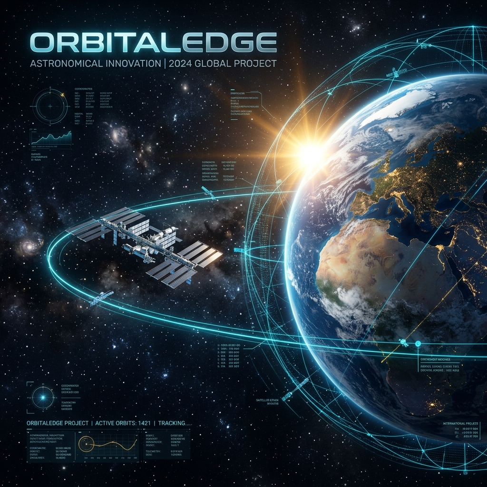

# 🛸 OrbitalEdge v1.3.0-PREMIUM

**OrbitalEdge**, uç birim donanımları (Jetson, Raspberry Pi) ve modern IoT ekosistemleri için tasarlanmış, yüksek hassasiyetli bir **Astronomik İşletim Katmanı**'dır. Bu proje, C++17 performansını, Rust güvenliğini ve Yapay Zeka öngörüsünü tek bir çatıda birleştirir.

---

## 🏛️ Mühendislik ve Masterclass Teorisi

OrbitalEdge'in kalbinde, yüzyılların astronomik birikimi ve modern hesaplamalı fizik yatar:

### 1. VSOP87 (Variations Séculaires des Orbites Planétaires)
Gezegen konumları için kullanılan bu analitik teori, binlerce periyodik terimin (amplitüd, faz, frekans) toplamıyla çalışır. OrbitalEdge, bu serileri **SIMD/NEON** birimleri ile paralel işleyerek mikro-saniye düzeyinde sonuç üretir.

### 2. SGP4 (Simplified General Perturbations)
Alçak yörünge uydularını (LEO) takip etmek için kullanılan bu model, atmosferik sürüklenme ve dünyanın basıklığı gibi etkileri hesaba katar. ISS konumu, en güncel TLE (Two-Line Element) verileriyle gerçek zamanlı simüle edilir.

### 3. Olasılıksal Görünürlük (AI-Driven)
`VisibilityAI` modülü, Rayleigh saçılması, atmosferik nem ve ufuk yüksekliği verilerini bir MLP (Multi-Layer Perceptron) üzerinden işleyerek, gözlemciler için **dinamik başarı puanı** üretir.

---

## 🛰️ Yeni Özellikler (Aşama 9-10)

- **Uydu Takip Motoru**: ISS ve binlerce LEO nesnesi için gerçek zamanlı SGP4 desteği.
- **Yapay Zeka Katmanı**: Görünürlük tahmini ve akıllı kalibrasyon önerileri.
- **WebAssembly (Wasm)**: Motorun tarayıcı üzerinde backend'siz (serverless) çalışma yeteneği.
- **Premium Banner & UI**: Geliştirilmiş Canvas Dashboard ve terminal UI görselleştirme.

---

## 🏗️ 7-Katmanlı Mimari

OrbitalEdge, mikrodenetleyicilerden gelişmiş robotik platformlara kadar ölçeklenebilirlik sağlayan modüler bir "7-katmanlı" mühendislik felsefesi üzerine inşa edilmiştir:

1.  **Core (C++17)**: VSOP87/ELP-2000 matematiksel modeller.
2.  **Bindings (Rust/Python)**: Çok dilli API erişimi.
3.  **Analytics (AI/SGP4)**: Olay tahmini ve uydu takibi.
4.  **Hardware (HAL)**: IMU/GPS ve Ekran sürücüleri.
5.  **Integration (MQTT/ROS2)**: IoT ve robotik ekosistem bağlantısı.
6.  **Tools (CLI/Bench)**: Performans ölçümü ve terminal dashboard.
7.  **Web (Wasm/Canvas)**: 60FPS gerçek zamanlı görselleştirme.

---

## 🧪 Profesyonel Test Suit'i

Google Test (GTest) entegrasyonu ile endüstri standartlarında doğrulama:

```bash
cd build
cmake ..
make
ctest
```

---

## 📜 Lisans
Bu proje **MIT Lisansı** altında yayınlanan bir başyapıttır (Masterpiece).
